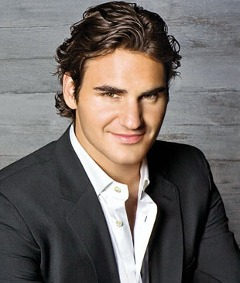

tennis_models
=============

A fun project to try to model Roger Federer, Andy Murray, Novak Djokovic, and Rafael Nadal's playing styles with 
data scraped off of european gambling websites on the past five years of tennis majors. We basically did stepwise logistic
regression without knowing what stepwise logistic regression was, looking at Aikake's Information Criterion and Likelihood Ratios to tune the models.

Some interesting findings:
- Nadal and Djokovic's match wins are almost entirely uncorrelated with winning the first set (not the case with Federer and Murray).You can beat them in the first set and (naievely) be almost no better at predicting the result of the match (which is kind of insane). HOWEVER: If you know they won the first set AND you know that their first serve is hot, it's pretty much game over. 
- A complex, graceful tennis animal, Federer's game takes quite a few variables to tune a good model--one basically need metrics on all aspects of his game to classify his wins (How is Roger serving? Is he converting on his break points? Did he get off to a good start? Is he playing aggressively?, etc.);
- Conversely, if Novak and Rafa serves are on, you can basically call the match for them. It washes away any other predictor in multivaritae models.
- We couldn't find any combination of variables that could  classify Murray's wins and losses better than 84%, probably attributble to his variable, defensive style which is not very uniform (he can win in a lot of different ways, but no subset of them is great at modeling his performance)(probably a good candidate for dimensionality reduction). He is also a very emotional tennis player prone to the passionate fits of rage and joy on the court. He is unpredictable, emotional, and awesome. We love Andy.

Completed with Malik Mubeen (2013)
